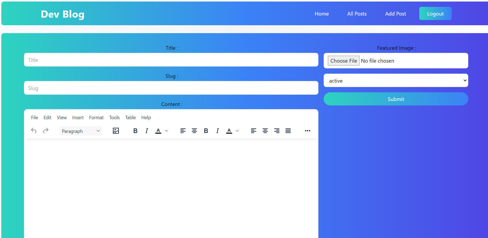

# DevBlog

DevBlog is a cutting-edge blog platform that focuses on an interactive and responsive user experience. Built with the latest tools in the React ecosystem, it provides an intuitive interface for creating, managing, and reading blog posts with real-time features and modern UI.

 <!-- Add an image or logo for visual appeal -->

## 🌟 **Features**

- **📝 Rich Text Editor**: Craft engaging blog posts with an embedded TinyMCE editor, providing real-time formatting tools like bold, italic, lists, and media embeds.
- **📊 State Management with Redux Toolkit**: Experience smooth and efficient data flow across components, ensuring optimal app performance.
- **📋 Form Handling**: React Hook Form offers dynamic validation and seamless user input handling, making the form experience more interactive.
- **🔀 Dynamic Routing**: Single-page application (SPA) navigation with React Router DOM ensures quick transitions between pages without page reloads.
- **🔔 Instant Notifications**: Users receive real-time notifications and alerts via React Toastify, making interactions lively and engaging.
- **🎨 Responsive UI with Tailwind CSS**: Enjoy a fully responsive interface that adapts beautifully to any screen size, from desktops to mobile devices.
- **🌐 Icons Galore**: An extensive collection of icons via React Icons to enhance user interaction and engagement.
- **🔒 Secure and Scalable Backend**: Appwrite integration offers secure authentication, database management, and file storage.

## 🚀 **Getting Started**

Follow these steps to set up DevBlog locally:

1. **Clone the repository**:

```bash
git clone <repository-url>
```

2. **Navigate to the project directory**:

```bash
cd devblog
```

3. **Install dependencies**:

```bash
npm install
```

4. **Run the development server**:

```bash
npm run dev
```

Open [http://localhost:3000](http://localhost:3000) in your browser to see DevBlog in action.

## 🛠 **Interactive Commands**

You can run several interactive commands in the project directory:

### `npm run dev`

Starts the development server with hot-reloading enabled. Any code changes you make will automatically refresh the browser and apply them instantly.

### `npm run build`

Creates a production-ready build of the app in the `dist` folder. All JavaScript, CSS, and other assets are minified and optimized for fast loading.

### `npm run preview`

Allows you to simulate the live version of your site locally after a production build. Perfect for testing before deploying.

### `npm run lint`

Checks your code quality using ESLint, enforcing best practices and consistent formatting.

## 🌐 **Key Technologies**

- **React**: Modern UI library for building interactive user interfaces.
- **Redux Toolkit**: Simplified state management.
- **TinyMCE**: A versatile rich text editor to craft content.
- **React Hook Form**: Advanced form handling and validation.
- **React Icons**: Over 2,500 icons to enrich the UI.
- **Tailwind CSS**: Utility-first CSS framework for rapid and responsive design.
- **Appwrite**: Backend as a service, handling authentication, database, and file uploads.
- **Vite**: Blazing-fast build tool optimized for modern frontend projects.

## 🖼 **Screenshots**

| Home Page                                        | Blog Editor                                   | Dashboard                                              |
| ------------------------------------------------ | --------------------------------------------- | ------------------------------------------------------ |
|  |  |  |

## 💡 **How to Contribute**

We’re always open to collaboration! Here’s how you can get involved:

1. Fork the repo.
2. Create a feature branch: `git checkout -b feature/your-feature-name`.
3. Commit your changes: `git commit -m 'Add feature'`.
4. Push to the branch: `git push origin feature/your-feature-name`.
5. Create a pull request.

## 🙋 **Got Questions?**

Join our community! You can:

- Submit an issue on GitHub.
- Ask questions in the discussion section.
- Contact us via email or social media.

## 📄 **License**

This project is licensed under the MIT License - see the LICENSE file for more details.

---

💻 **Stay Connected**  
Follow us on [Twitter](https://twitter.com/yourhandle) | [LinkedIn](https://linkedin.com/in/yourprofile) | [GitHub](https://github.com/codingMonk08/devblog) for the latest updates!

---

🔗 **Download the DevBlog app today and start sharing your stories!**
